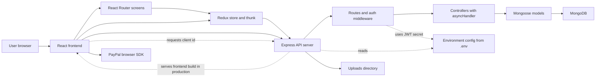

# Architecture — proshop_mern

This project is a legacy MERN e-commerce application with a React frontend, an Express API backend, and MongoDB persistence through Mongoose. The diagram below shows the main runtime containers and relationships as inferred from the current codebase, especially `backend/server.js`, backend routes/controllers/models, `frontend/src/App.js`, `frontend/src/store.js`, and the checkout screens.

## Runtime flow

- Main browsing flow: browser requests the React app, React Router selects a screen, Redux thunk actions call backend REST endpoints with `axios`, Express routes hand off to controllers, and controllers read or write MongoDB through Mongoose models.
- Auth flow visible in code: login and registration call `/api/users` and `/api/users/login`; the backend returns a JWT; the frontend stores `userInfo` in `localStorage`; protected requests send `Authorization: Bearer <token>`; backend `protect` and `admin` middleware enforce private and admin-only routes.
- Checkout and payment flow visible in code: shipping address and payment method are kept in Redux and persisted to `localStorage`; placing an order posts to `/api/orders`; the order screen fetches `/api/config/paypal`, loads the PayPal browser SDK, and sends payment results back to `/api/orders/:id/pay`.
- Admin upload flow visible in code: product image uploads go through `/api/upload`, which stores files in the local `uploads/` directory and is protected by both `protect` and `admin` middleware.

## Notes and limitations

- This diagram is based on static code inspection, not on live tracing of a deployed environment.
- The frontend and backend are shown as separate runtime containers during development, but the backend also serves the built frontend in production.
- PayPal is included because the code explicitly fetches a PayPal client ID and loads the PayPal browser SDK on the order screen.
- Minor internal details such as every reducer, component, and helper are intentionally omitted to keep the diagram readable.
- `.env` is local-only configuration and must never be committed; documentation should only use safe placeholder values.
