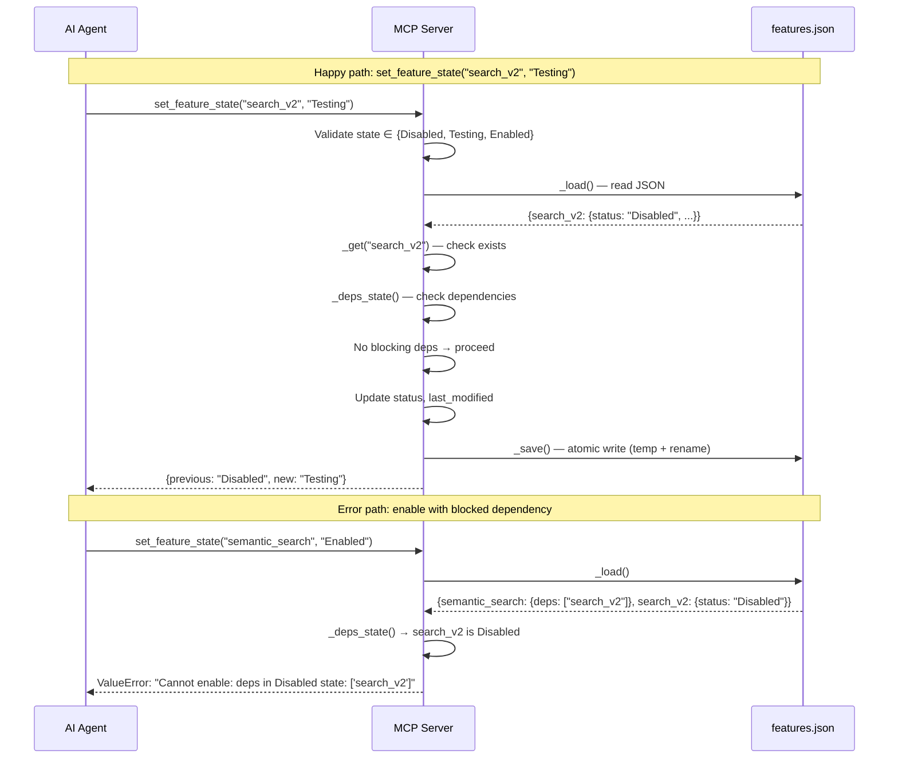

# MCP Feature Flags Server — Module Spec

**Module:** `ai/mcp-feature-flags/server.py` (237 lines)
**Language:** Python 3 (FastMCP)
**Last updated:** 2026-05-25

## 1. Overview

The MCP Feature Flags server is a Python FastMCP service that provides CRUD-like operations on feature flags stored in `backend/features.json`. It acts as the AI agent's interface to the feature flag system — AI assistants (Claude, OpenCode agents) call these MCP tools to read and modify feature flag states.

**Exposed tools (4):**
- `get_feature_info(feature_name)` — read one flag's status, traffic %, dependencies
- `set_feature_state(feature_name, state)` — change status (Disabled/Testing/Enabled)
- `adjust_traffic_rollout(feature_name, percentage)` — set traffic % (0-100)
- `list_features()` — list all flags with status and traffic %

**Business rules:**
1. State must be one of: `Disabled`, `Testing`, `Enabled` (case-sensitive)
2. Cannot enable a feature if any dependency is `Disabled`
3. Setting state to `Disabled` automatically resets traffic to 0
4. Traffic > 0 is impossible while status is `Disabled`
5. Percentage must be integer 0-100

**Data flow:** MCP tool → `_load()` (read JSON) → modify in-memory → `_save()` (atomic write via temp file + rename)

**Assumptions:**
- `features.json` exists and is valid JSON
- Features have: `name`, `status`, `traffic_percentage`, `last_modified`, `dependencies` (optional)
- Single-writer assumption (no concurrent MCP instances)

## 2. Decision Table

| # | Condition | Then | Else | Edge Case |
|---|-----------|------|------|-----------|
| 1 | `state not in ALLOWED_STATES` | raise ValueError | continue | Case-sensitive: "enabled" ≠ "Enabled" |
| 2 | `feature_name not in data` | raise ValueError | continue | Empty string feature name |
| 3 | `state == "Enabled"` AND any dep is "Disabled" | raise ValueError with blocking deps list | allow state change | Dep exists but has no status field |
| 4 | `state == "Disabled"` | set traffic_percentage = 0 | keep traffic | Was traffic already 0? |
| 5 | `percentage not int` OR `< 0` OR `> 100` | raise ValueError | continue | Float like 25.5, negative, 101 |
| 6 | `status == "Disabled"` AND `percentage > 0` | raise ValueError | set traffic | Percentage = 0 on disabled is OK |
| 7 | `features.json` missing/corrupt | exception on `_load()` | normal load | Empty file, invalid JSON, permissions |
| 8 | Dependency circular reference | not checked — infinite recursion possible | n/a | A depends on B depends on A |
| 9 | `_save()` — temp file write | atomic rename via `Path.replace()` | n/a | Disk full, permissions, concurrent write |
| 10 | `list_features()` — empty features.json | return empty list | return list of dicts | `{}` is valid |

## 3. Sequence Diagram

## 4. Edge Cases

1. **Feature name is empty string** — `_get("")` will raise ValueError "Feature '' not found"
2. **Feature name has special characters** — keys with spaces, unicode, dots could exist in JSON
3. **Circular dependencies** — A→B→A: `_deps_state` doesn't detect cycles, could cause issues if dep chain is deep
4. **Concurrent MCP instances** — two MCP servers writing to same file: last-write-wins, data loss
5. **Express server concurrent write** — Node.js featureFlagsRoutes.js also writes to features.json (no locking)
6. **features.json deleted while running** — `_load()` raises FileNotFoundError
7. **features.json locked by another process** — OS-level file lock prevents read/write
8. **Disk full during _save()** — temp file write fails, features.json unchanged (safe due to atomic rename)
9. **Permission denied on features.json** — PermissionError on read or write
10. **Malformed JSON in features.json** — `json.load()` raises JSONDecodeError
11. **Feature has no "status" field** — KeyError when accessing `feature["status"]`
12. **Feature has no "traffic_percentage" field** — `int()` on None raises TypeError in get_feature_info
13. **Dependency refers to non-existent feature** — `_get(dep, data)` raises ValueError inside `_deps_state`
14. **percentage is float (e.g. 25.5)** — `isinstance(percentage, int)` check rejects, but MCP schema declares `int` so client may coerce
15. **Very large features.json (>100MB)** — `json.load()` loads all into memory, potential OOM

## 5. Open Questions

1. Should there be file locking between MCP server and Express routes?
2. Should circular dependency detection be added?
3. Should _load() cache with TTL instead of reading disk every time?
4. What happens if a feature is deleted from features.json while MCP server is running?

## 6. Suggested Characterization Tests

1. `test_get_feature_info_happy` — valid feature returns correct dict shape
2. `test_get_feature_info_missing` — non-existent feature raises ValueError
3. `test_set_state_disabled_resets_traffic` — Disabled → traffic becomes 0
4. `test_set_state_enabled_blocked_dep` — cannot enable with disabled dependency
5. `test_set_state_invalid` — invalid state string raises ValueError
6. `test_adjust_traffic_on_disabled` — cannot set traffic > 0 on disabled feature
7. `test_adjust_traffic_boundary` — 0 and 100 are valid, -1 and 101 are not
8. `test_list_features_empty` — empty features.json returns []
9. `test_save_atomic` — verify temp file + rename pattern
10. `test_concurrent_write` — simulate race condition (document, don't fix)
