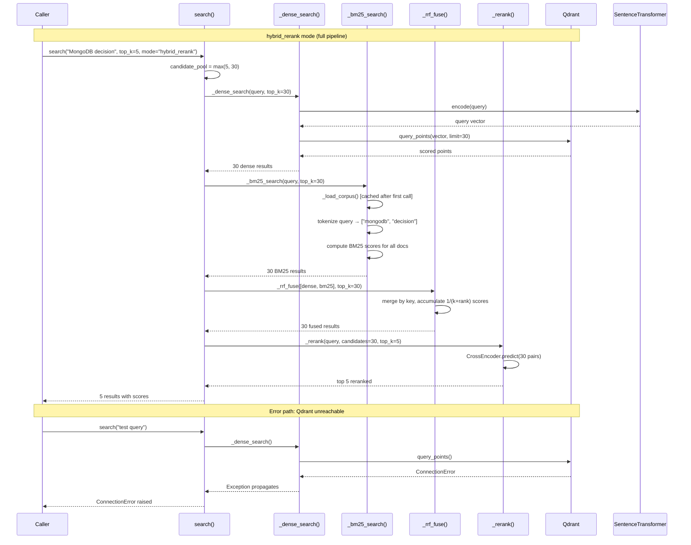

# RAG Query Engine — Module Spec

**Module:** `ai/rag/query.py` (290 lines)
**Language:** Python 3 (Qdrant + SentenceTransformers)
**Last updated:** 2026-05-25

## 1. Overview

The RAG Query Engine provides vector-based document search over the project's documentation corpus stored in Qdrant. It supports three search modes: dense (vector-only), hybrid (vector + BM25 with RRF fusion), and hybrid_rerank (hybrid + cross-encoder reranking).

**Public API:**
- `search(query, top_k, type_filter, mode, candidate_pool)` — main entry point, returns ranked document chunks

**Internal components:**
- `_dense_search()` — encodes query with SentenceTransformer, queries Qdrant
- `_bm25_search()` — lexical BM25 search over in-memory corpus
- `_rrf_fuse()` — Reciprocal Rank Fusion merging dense + BM25 results
- `_rerank()` — CrossEncoder reranking of candidates
- `_load_corpus()` — scrolls entire Qdrant collection into memory for BM25

**Lazy singletons:** Model, Qdrant client, reranker, and corpus are loaded on first use and cached globally.

**Business rules:**
1. Three search modes: `dense`, `hybrid`, `hybrid_rerank`
2. `candidate_pool` controls how many candidates to fetch before final top_k selection
3. BM25 uses k1=1.5, b=0.75 (standard Okapi BM25 parameters)
4. RRF uses configurable `rrf_k` from CFG (default 60)
5. Results are deduplicated by `source_file::chunk_index` key during RRF fusion

**Data flow:** query string → encode → Qdrant dense search → (optional) BM25 on in-memory corpus → RRF fusion → (optional) cross-encoder rerank → top_k results

## 2. Decision Table

| # | Condition | Then | Else | Edge Case |
|---|-----------|------|------|-----------|
| 1 | `mode == "dense"` | return dense results[:top_k] | continue to hybrid | Only Qdrant query, no BM25 |
| 2 | `mode == "hybrid"` | return RRF-fused results[:top_k] | continue to rerank | Dense + BM25 + RRF |
| 3 | `mode == "hybrid_rerank"` | return reranked results | raise ValueError | Slowest, highest quality |
| 4 | Unknown mode | raise ValueError | n/a | Typo in mode string |
| 5 | `type_filter` provided | add Qdrant filter + filter BM25 corpus | search all types | Empty filter string treated as None? |
| 6 | Empty query tokens (BM25) | return [] | compute BM25 | Query with only special chars |
| 7 | Empty corpus | BM25 returns [] | n/a | Qdrant empty or unreachable on corpus load |
| 8 | `candidate_pool < top_k` | set to max(top_k, candidate_pool) | use candidate_pool | Ensures enough candidates |
| 9 | No candidates for rerank | return [] | rerank list | CrossEncoder needs >= 1 pair |
| 10 | Qdrant unreachable | exception on dense_search | n/a | ConnectionError |
| 11 | Duplicate key in RRF | accumulate score on existing entry | create new entry | Same chunk from both dense + BM25 |
| 12 | BM25 score <= 0 | skip document | include in results | Document with no matching terms |

## 3. Sequence Diagram

## 4. Edge Cases

1. **Qdrant down** — `_get_client()` succeeds (lazy), `query_points()` raises ConnectionError
2. **Empty Qdrant collection** — dense returns [], BM25 corpus empty, final result []
3. **Query is empty string** — SentenceTransformer encodes to a vector (undefined behavior), BM25 returns [] (no tokens)
4. **Query with only special characters ("$$$")** — `_tokenize` returns [], BM25 returns []
5. **Very long query (10K chars)** — SentenceTransformer truncates to model max_seq_length (typically 512 tokens)
6. **Unicode query (Russian, Chinese)** — `_tokenize` uses `\w+` with `re.UNICODE`, should handle correctly
7. **Corpus has millions of documents** — `_load_corpus()` OOMs, BM25 O(N) scan extremely slow
8. **type_filter value doesn't match any docs** — returns [] for both dense and BM25
9. **Duplicate documents in corpus** — same content with different IDs, RRF handles via key dedup
10. **CrossEncoder model not found** — `_get_reranker()` raises on download/load failure
11. **SentenceTransformer model not found** — same issue on first use
12. **top_k = 0** — returns empty list (valid but unusual)
13. **top_k > total docs** — returns all available docs (less than top_k)
14. **candidate_pool = 1, top_k = 1** — minimal pipeline, single result
15. **BM25 term frequency overflow** — document with millions of repetitions of a word
16. **RRF k parameter = 0** — division by zero: `1/(0 + rank)` — would cause issues
17. **Concurrent search calls** — safe for reads (globals are read-only after init), but `_load_corpus()` has race on first init

## 5. Open Questions

1. Should `_load_corpus()` have a TTL to pick up new documents?
2. Should BM25 IDF values be pre-computed on corpus load for performance?
3. Is `_CORPUS` thread-safe? (Python GIL protects, but async frameworks may not)
4. Should there be a fallback if Qdrant is unreachable (e.g., BM25-only mode)?
5. What is the expected corpus size? Performance degrades significantly beyond 50K documents.

## 6. Suggested Characterization Tests

1. `test_search_dense_mode` — returns results with score field, no BM25 score
2. `test_search_hybrid_mode` — results have both dense and BM25 contributions
3. `test_search_hybrid_rerank` — results have rerank_score field
4. `test_search_invalid_mode` — raises ValueError
5. `test_search_empty_query` — returns results (dense) or [] (BM25)
6. `test_bm25_no_matching_terms` — returns []
7. `test_rrf_fuse_deduplication` — same key from two sets merged correctly
8. `test_rrf_fuse_empty_sets` — returns []
9. `test_tokenize_unicode` — Russian/Chinese text tokenized correctly
10. `test_candidate_pool_minimum` — candidate_pool auto-adjusted to max(top_k, pool)
